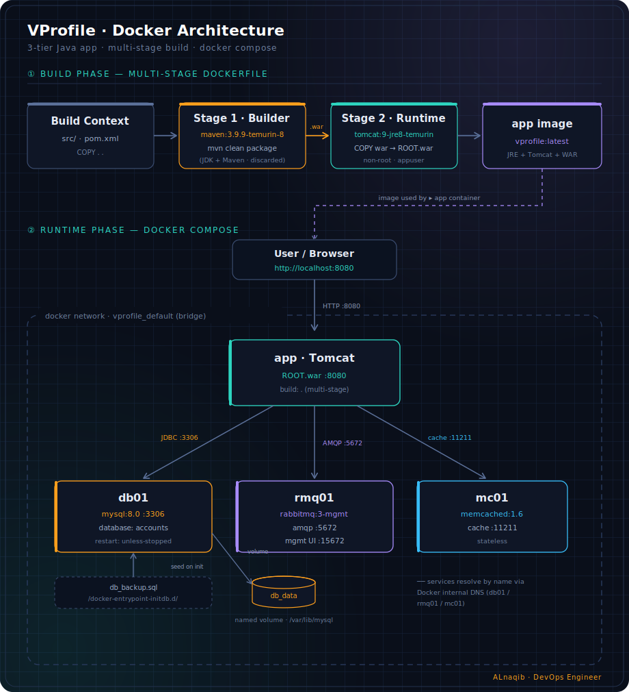

<div align="center">

# VProfile on Docker

**Multi-stage containerized deployment of a 3-tier Java web application**

[](https://www.docker.com/)
[](https://docs.docker.com/compose/)
[](https://tomcat.apache.org/)
[](https://openjdk.org/)
[](https://www.mysql.com/)
[](https://www.rabbitmq.com/)
[](https://memcached.org/)

</div>

---

## Overview

**VProfile** is a classic **3-tier Java (WAR)** web application that runs on **Apache Tomcat** and depends on three backing services: a **MySQL** database, a **RabbitMQ** message broker, and a **Memcached** cache.

This repository containerizes the entire stack with **Docker** and **Docker Compose**. The application image is produced through a **multi-stage build** (Maven compiles the WAR, Tomcat serves it), while the backing services run as their official images. It mirrors the original *on-prem* topology (5 Vagrant VMs) one-to-one — each VM becomes a container, and the service hostnames (`db01`, `rmq01`, `mc01`) carry over unchanged so the application configuration stays identical.

## Architecture

<div align="center">
  
</div>

The diagram shows the two phases:

- **Build phase** — A multi-stage `Dockerfile` compiles the source with Maven (stage 1, discarded) and copies the resulting WAR into a slim Tomcat/JRE runtime as `ROOT.war` (stage 2).
- **Runtime phase** — `docker compose` starts four containers on a shared bridge network. The `app` container reaches `db01`, `rmq01`, and `mc01` by their **service names**, which Docker's internal DNS resolves automatically.

## Tech Stack

| Service | Image | Port(s) | Role |
| --- | --- | --- | --- |
| `app` | Built from `tomcat:9-jre8-temurin` | `8080` | Tomcat serving the VProfile WAR as `ROOT.war` |
| `db01` | `mysql:8.0` | `3306` | Primary database (`accounts`), persisted on a named volume |
| `rmq01` | `rabbitmq:3-management` | `5672`, `15672` | Message broker + management UI |
| `mc01` | `memcached:1.6` | `11211` | In-memory cache layer |

## Prerequisites

- [Docker Engine](https://docs.docker.com/engine/install/)
- [Docker Compose v2](https://docs.docker.com/compose/install/) (bundled with recent Docker Desktop / Engine)

```bash
docker --version
docker compose version
```

## Quick Start

```bash
# 1. Clone the repository
git clone https://github.com/yousefsalemW/vprofile-docker.git
cd vprofile-docker

# 2. Build and start the full stack
docker compose up --build -d

# 3. Verify all four containers are running
docker compose ps

# 4. Follow the application logs (optional)
docker compose logs -f app
```

### Access

| URL | Service |
| --- | --- |
| http://localhost:8080 | VProfile application (login page) |
| http://localhost:15672 | RabbitMQ management UI (`guest` / `guest`) |

> **Startup note:** `depends_on` only waits for a container to **start**, not to become **ready**. The `app` may log a few connection errors during the first 10–20 seconds while MySQL finishes initializing, then recover. On first boot, `db_backup.sql` is auto-imported into MySQL via `/docker-entrypoint-initdb.d/`.

### Stop and clean up

```bash
docker compose down       # stop and remove containers
docker compose down -v     # also remove the database volume
```

## Project Structure

```text
.
├── Dockerfile               # Multi-stage build (Maven -> Tomcat)
├── docker-compose.yml       # Orchestrates the four services
├── .dockerignore            # Keeps build context clean (target/, .git, secrets)
├── pom.xml                  # Maven build definition
├── architecture.svg         # Architecture diagram (embedded above)
└── src/
    └── main/resources/
        ├── application.properties   # Backend connection config
        └── db_backup.sql            # Database seed data
```

> The `target/` directory (Maven output) is **not** required — the image is built fresh inside the `Dockerfile`, and `target/` is excluded by `.dockerignore`. You can safely run `mvn clean` (or `rm -rf target/`) before committing.

## Configuration

The application connects to its backing services by **hostname**, and each hostname equals the compose **service name**. This mapping lives in `src/main/resources/application.properties`:

| Property | Value | Resolves to |
| --- | --- | --- |
| `jdbc.url` | `jdbc:mysql://db01:3306/accounts` | `db01` container |
| `rabbitmq.address` | `rmq01` | `rmq01` container |
| `memcached.active.host` | `mc01` | `mc01` container |

Because of this, **renaming a service in `docker-compose.yml` requires updating `application.properties` to match.**

## On-prem to Docker

The Docker setup preserves the original on-prem architecture — every VM maps to a container:

| Component | On-prem (Vagrant VM) | Docker Compose |
| --- | --- | --- |
| Database | `db01` — MariaDB | `db01` — `mysql:8.0` |
| Cache | `mc01` — Memcached | `mc01` — `memcached:1.6` |
| Message broker | `rmq01` — RabbitMQ | `rmq01` — `rabbitmq:3` |
| Application | `app01` — `tomcat.sh` | `app` — multi-stage image |
| Reverse proxy | `web01` — Nginx | *not included* |
| Name resolution | hostmanager | Docker internal DNS |

## Notes & Gotchas

- **`depends_on` is not a readiness gate.** For deterministic startup, add a `healthcheck` to `db01` and use `depends_on: condition: service_healthy`.
- **No Nginx reverse proxy** in this compose file — the app is exposed directly on `8080` (the on-prem `web01` role is not containerized here).
- **No Elasticsearch** — `application.properties` still references `vprosearch01`, so the search feature will not resolve, but the application itself starts normally.
- **Secrets are inline** in the compose file for local use. Move them to a `.env` file or Docker secrets before any shared/staging deployment.

## Roadmap

- [ ] Add `healthcheck` blocks for every service
- [ ] Move credentials to `.env` / Docker secrets
- [ ] Add an Nginx reverse-proxy container
- [ ] Pin all image tags to fixed digests
- [ ] Split into frontend / backend networks
- [ ] CI pipeline to build and push the app image to Docker Hub

## Author

**Yousef** — DevOps Engineer

- GitHub: [@yousefsalemW](https://github.com/yousefsalemW)
- Docker Hub: [alnaqib](https://hub.docker.com/u/alnaqib)

<div align="center">

*ALnaqib · DevOps Engineer*

</div>
